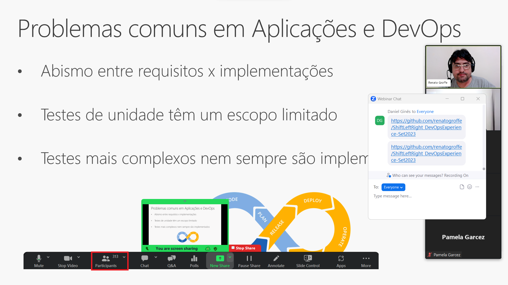
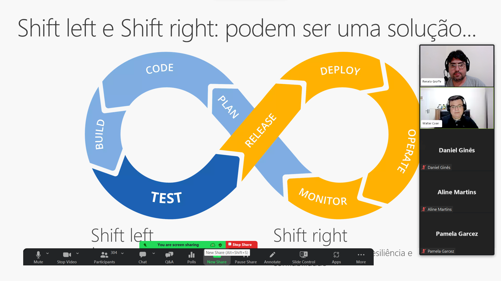
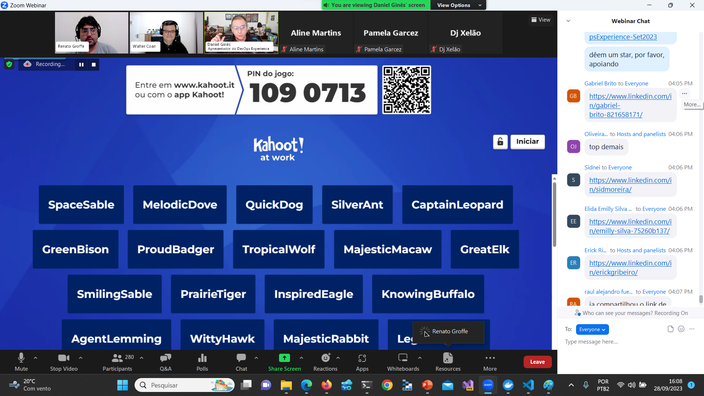
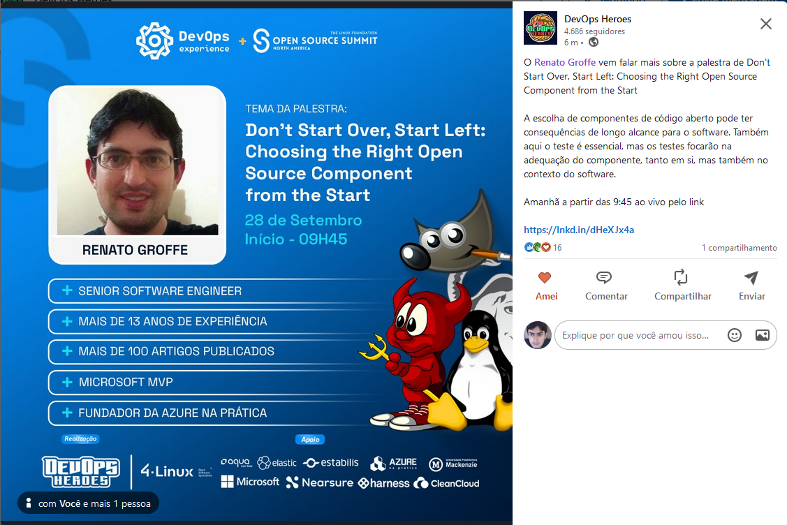

# ShiftLeftRight_DevOpsExperience-Set2023

Conteúdos da apresentação **Não recomece um projeto, inicie com Shift Left: escolhendo componentes open source certos desde o início** realizada na edição de **Setembro-2023** do **DevOps Experience**.

Título da Apresentação: **Don't Start Over, Start Left: Choosing the Right Open Source Component from the Start**

Data: **28/09/2023 (quinta-feira)**

Tipo do evento: **Online**

Ferramenta de transmissão: **Zoom**

Tecnologias utilizadas: **Kubernetes, KEDA, Apache Kafka, Apache Kafka KEDA Scaler, Azure Kubernetes Service (AKS), Linux, k9s, OpenTelemetry, ASP.NET Core, .NET 7, ASP.NET Core, Redis**

Número de participantes: **313 pessoas (pico de audiência ao longo da live)**

Link do evento: [**LinkedIn**](https://www.linkedin.com/posts/devopsheroes_o-renato-groffe-vem-falar-mais-sobre-a-palestra-activity-7112876224053415936-OJY8?utm_source=share&utm_medium=member_desktop)

Esta palestra foi realizada em conjunto com meu amigo **Walter Coan (Microsoft MVP)**.

Deixo aqui meus agradecimentos ao **Daniel Ginês** e à **Aline Martins** por todo o apoio para que eu partipasse como palestrante de mais uma edição do **DevOps Experience**.

---

